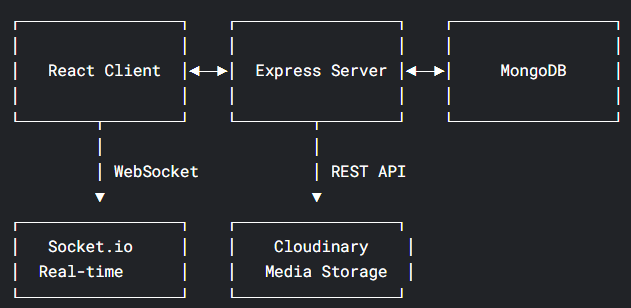
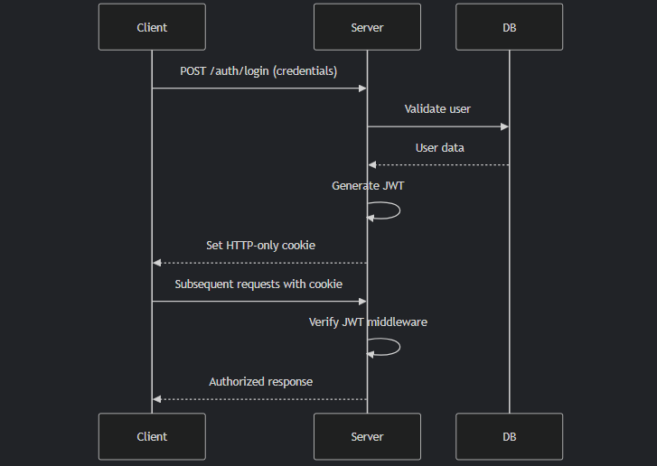
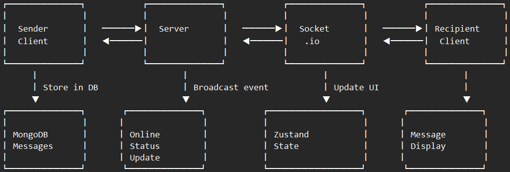
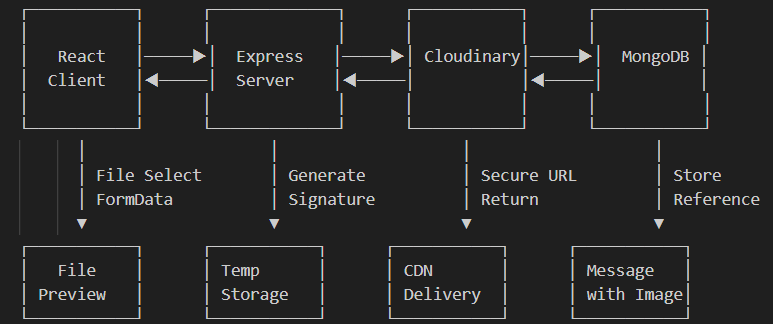
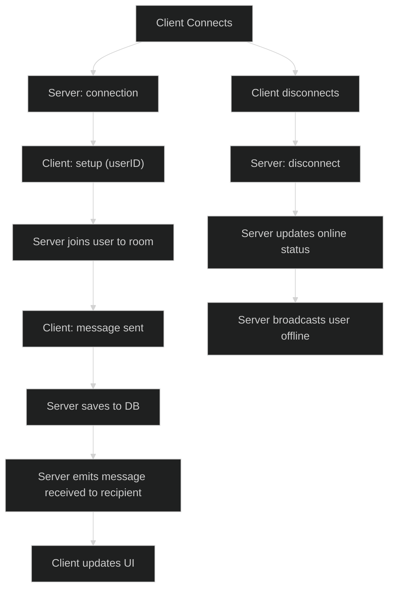

# Chat Application - MERN Stack with Real-time Messaging

   

A full-featured real-time chat application built with the MERN stack (MongoDB, Express, React, Node.js) featuring authentication, authorization, online status tracking, and real-time messaging powered by Socket.io.

## Features

- **User Authentication**: Secure JWT-based authentication system
- **Real-time Messaging**: Instant message delivery with Socket.io
- **Online Status**: Real-time user presence indicators
- **Media Sharing**: Image uploads via Cloudinary integration
- **State Management**: Global state handled with Zustand
- **Responsive UI**: Built with TailwindCSS and DaisyUI components
- **Error Handling**: Comprehensive error handling on client and server

## Tech Stack

### Frontend

- **React**: JavaScript library for building user interfaces
- **TailwindCSS**: Utility-first CSS framework
- **DaisyUI**: Component library for TailwindCSS
- **Zustand**: Lightweight state management solution
- **Socket.io Client**: Real-time communication

### Backend

- **Node.js**: JavaScript runtime environment
- **Express**: Web application framework
- **MongoDB**: NoSQL database
- **Mongoose**: MongoDB object modeling
- **JWT**: JSON Web Tokens for authentication
- **Socket.io**: Real-time bidirectional communication
- **Cloudinary**: Cloud-based image storage
- **Bcrypt**: Password hashing
- **CORS**: Cross-origin resource sharing

## System Architecture

### High-Level Overview



### Authentication Flow

1. User submits credentials
2. Server validates and creates JWT
3. Token stored in HTTP-only cookie
4. Subsequent requests include token for authorization
5. Middleware verifies token before granting access



### Real-time Messaging Flow

1. Client establishes Socket.io connection
2. Server maintains socket IDs for online users
3. On message send:
   - Message saved to database
   - Event emitted to recipient's socket
   - UI updates in real-time
4. Online status updates broadcast to relevant users



### File Upload Flow

1. Client selects system_designs
2. Frontend uploads to Cloudinary
3. Cloudinary returns secure URL
4. URL included in message payload
5. Message processed normally



### Socket Events

- `connection` - New socket connection
- `disconnect` - Socket disconnected
- `setup` - Initialize user socket
- `message received` - New message notification
- `user online` - User came online
- `user offline` - User went offline
- `typing` - User is typing indicator
- `stop typing` - User stopped typing



## Installation

### Prerequisites

- Node.js (v14 or higher)
- MongoDB Atlas account or local MongoDB instance
- Cloudinary account for media storage
- Git (optional)

### Setup Instructions

1. Clone the repository:

```bash
git clone https://github.com/yourusername/chat-app.git
cd chat-app
```

2. Install dependencies for both server and client:

```bash
npm install
cd client
npm install
cd ..
```

3. Set up environment variables:

Create a `.env` file in the **backend** directory with the following variables:

```env
# Server Configuration
PORT=5001
NODE_ENV=development

# Database
MONGODB_URI=mongodb+srv://<username>:<password>@cluster0.mongodb.net/chat-app?retryWrites=true&w=majority

# Authentication
JWT_SECRET=your_jwt_secret_key_here

# Cloudinary
CLOUDINARY_CLOUD_NAME=your_cloud_name
CLOUDINARY_API_KEY=your_api_key
CLOUDINARY_API_SECRET=your_api_secret
```


## Development

### Running Locally

1. Build the app
```bash
npm run build
```

2. Start the app
```bash
npm start
```

## Deployment

### Free Deployment Options

1. **Render.com** (Full stack)

   - Connect your GitHub repository
   - Set environment variables
   - Specify build command: `npm run build`
   - Start command: `npm start`
2. **Vercel (Frontend) + Cyclic (Backend)**

   - Deploy React app to Vercel
   - Deploy Node/Express to Cyclic
   - Configure CORS and environment variables
3. **Netlify (Frontend) + MongoDB Atlas + Cloudinary**

   - Similar to Vercel setup
   - Use Netlify for frontend hosting

### Deployment Checklist

- [ ] Set `NODE_ENV=production` in production environment
- [ ] Configure proper CORS origins
- [ ] Set secure cookie flags for production
- [ ] Implement proper logging
- [ ] Set up monitoring/alerting

## Contributing

Contributions are welcome! Please follow these guidelines:

1. Fork the repository
2. Create a feature branch (`git checkout -b feature/AmazingFeature`)
3. Commit your changes (`git commit -m 'Add some AmazingFeature'`)
4. Push to the branch (`git push origin feature/AmazingFeature`)
5. Open a Pull Request

---
**Note:** *Some Documentations are yet to be updated*
**Feel free to drop a star!! Happy Coding!** 🚀
